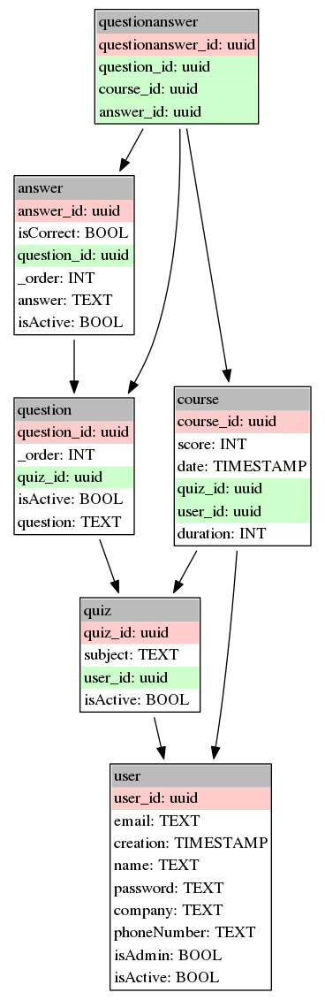
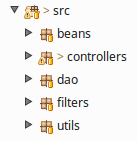
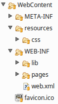
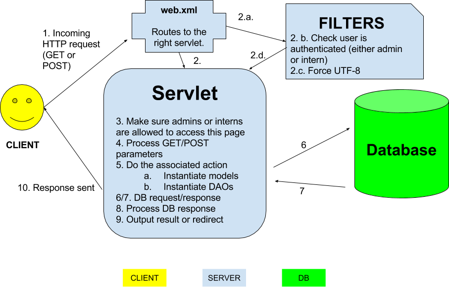

% Projet QCM - Java EE 
% Steve Lagache, Romain Pellerin
% SR03 27/05/2016

-------------------------------------------

# Cahier des charges

- Java EE 
- Tomcat
- MySQL

-------------------------------------------

# Cahier des charges

- Gestion :
    - d'utilisateurs (admin et stagiaire)
    - de QCM (que nous avons appelés quiz)
    - de questions
    - de réponses
    - des parcours d'utilisateurs
- Pouvoir passer un QCM, visualiser ses scores

-------------------------------------------

# Technos

- Java EE 8 (nouvelles fonctionnalités)
- Tomcat 8 (*latest stable*)
- Pas de bibliothèque autre que JSTL et MySQL connector

-------------------------------------------

# *Design patterns*

- DAO
- MVC
- Héritage
- Singleton (DB)

-------------------------------------------

-------------------------------------------

# Architecture \#1

-------------------------------------------

# Architecture \#2

-------------------------------------------

# Fonctionnement

-------------------------------------------

# À savoir 

- Filtres (2)
- Base de données
    - Cohérence
    - Contrôles
    - Pas de redondance
- Beans
    - Calqués sur la BDD
- DAO
    - Héritage
    - Interface (abstract)

-------------------------------------------

# À savoir 

- Email
    - Javamail
- Gestion projet
    - Eclipse
    - CLI (MySQL & Git)

-------------------------------------------

# Conclusion

- Sur le projet

- Sur Java EE

-------------------------------------------

# DEMO 

 
 
[http://localhost:8080/Projet2/](http://localhost:8080/Projet2/)

-------------------------------------------

Merci

_

Q & A
